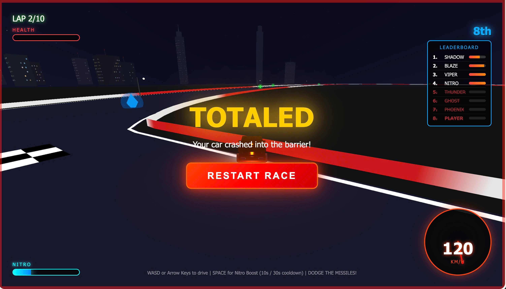

# Wasted Wheels 🏎️💨

A free 3D street racing game built with Three.js. Race through 10 laps while dodging police helicopters, missiles, and haunted ghosts!

**[Play Now →](https://racers.solo.engineer/)**



## Features

- **3D Racing** - Smooth third-person racing experience
- **Police Helicopters** - Dodge missiles from pursuing helicopters
- **Ghosts** - Avoid haunted spirits of crashed racers
- **Power-ups** - Collect health and shield pickups
- **Nitro Boost** - 10 second boost with 30 second cooldown
- **10 Laps** - Complete all laps to win
- **Leaderboard** - Race against 7 AI opponents
- **Realistic Sounds** - V8 engine, collisions, explosions

## Controls

| Key | Action |
|-----|--------|
| `W` / `↑` | Accelerate |
| `S` / `↓` | Brake / Reverse |
| `A` / `←` | Steer Left |
| `D` / `→` | Steer Right |
| `Space` | Nitro Boost |

## Tech Stack

- **Three.js** - 3D rendering
- **Web Audio API** - Procedural sound effects
- **Vanilla JS** - No frameworks, pure performance

## Quick Start

```bash
# Clone the repo
git clone https://github.com/pinkpixel-dev/wasted-wheels.git

# Open in browser
open index.html
```

Or use a local server:

```bash
# Using Python
python -m http.server 8000

# Using Node.js
npx serve
```

## Generate Icons

```bash
npm install
node generate-icons.js
```

## Project Structure

```
racing/
├── index.html          # Main HTML with SEO meta tags
├── game.js             # Game engine (Three.js)
├── generate-icons.js   # Icon generation script
├── screenshot.jpg      # OG image for social sharing
├── icon.jpg            # Source icon
├── icon-*.png          # Generated favicons
└── favicon.ico         # Browser favicon
```

## Gameplay Tips

1. **First 10 seconds** - You're invincible, use it to get ahead!
2. **Rear-end collisions** - Deal 10x damage, use strategically
3. **Nitro timing** - Save boost for straights, not curves
4. **Pickups** - Green = Health, Blue = Shield
5. **Ghosts** - They drain health on contact, avoid them!

## License

MIT

---

Made with 🔥 by [Solo Engineer](https://solo.engineer)
